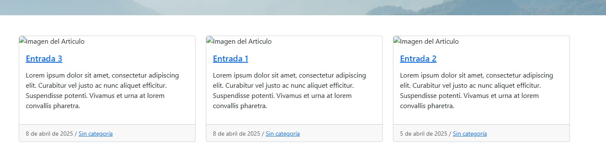
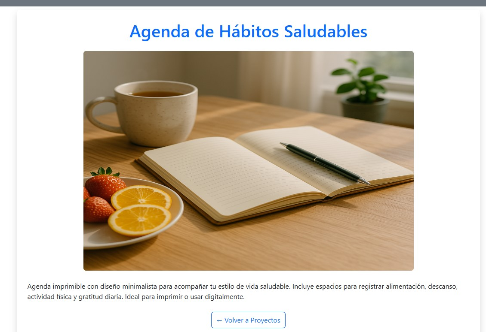
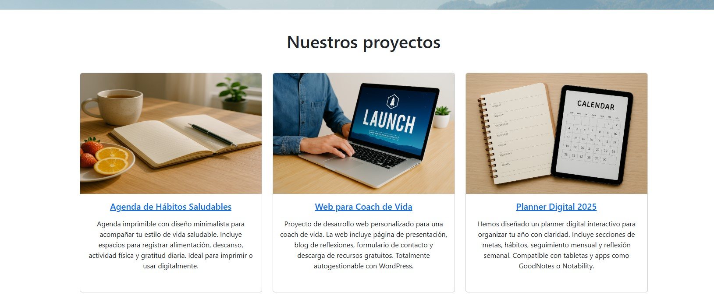
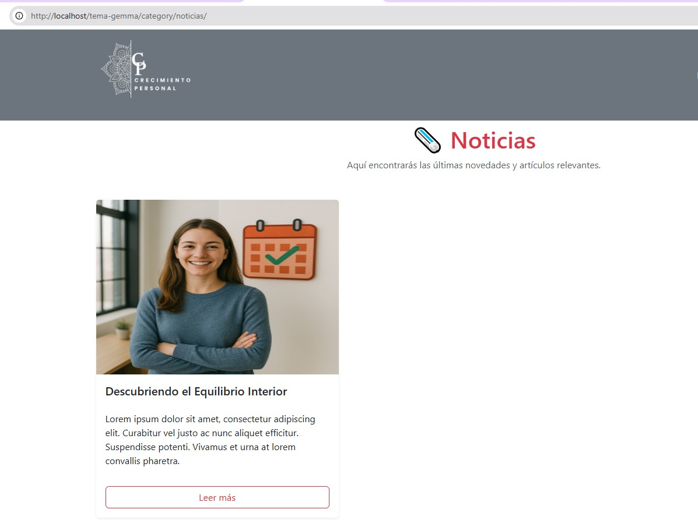

# 🧩 Práctica Semana 4 – Desarrollo Avanzado de Temas en WordPress

## 🎯 Objetivo

Profundizar en la creación de temas en WordPress incorporando conceptos avanzados como **tipos de contenido personalizados** y **plantillas de archivo dinámicas**.

---

## 1️⃣ Custom Post Type: `proyectos`

- Se registró un nuevo tipo de contenido personalizado llamado `proyectos` mediante la función `register_post_type()` en `functions.php`.

- Este post type incluye:
  - Título
  - Contenido
  - Imagen destacada (`add_theme_support('post-thumbnails')`)

- Se añadió un icono y un menú personalizado en el panel de administración de WordPress.

- Se crearon 3 proyectos de ejemplo desde el panel de administración, cada uno con su contenido e imagen destacada correspondiente.

---

## 2️⃣ Plantilla de archivo para el CPT – `archive-proyectos.php`

- Se creó el archivo `archive-proyectos.php` para mostrar el listado de proyectos del CPT.
- Cada proyecto se presenta en formato de tarjeta con:
  - Imagen destacada
  - Título enlazado
  - Extracto del contenido

- Diseño responsivo en columnas usando Bootstrap (3 columnas en escritorio).

### ✨ Resultado visible en:
[`http://localhost/tema-gemma/proyectos/`](http://localhost/tema-gemma/proyectos/)

---

## 3️⃣ Plantillas de categoría

### 🔹 `category.php`
- Plantilla genérica que aplica a cualquier categoría de WordPress.
- Muestra entradas en formato tarjeta con:
  - Imagen destacada
  - Título
  - Extracto del contenido

- Diseño responsivo de 3 columnas usando Bootstrap.

> Para comprobar su funcionamiento, se añadieron dos categorías:
- `noticias` (con plantilla específica)
- `mindfulness-y-bienestar` (usa la plantilla genérica)

---

### 🔹 `category-noticias.php`
- Plantilla específica para la categoría **“Noticias”**.
- Personalizaciones añadidas:
  - Encabezado con título en rojo y emoji 🗞️
  - Texto introductorio
  - Tarjetas coherentes con el resto del diseño pero destacadas visualmente

### 📍 URL de ejemplo para probar la plantilla específica:
[`http://localhost/tema-gemma/category/noticias`](http://localhost/tema-gemma/category/noticias)

---

## ✅ Fin Práctica

Con esta práctica se ha implementado:
- Un tipo de contenido personalizado completo
- Plantillas personalizadas para archivos y categorías

---

